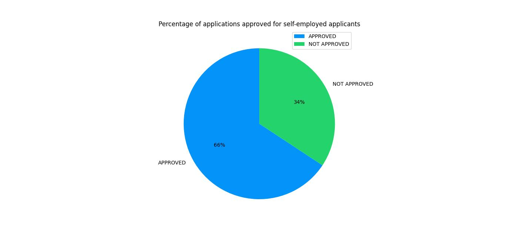
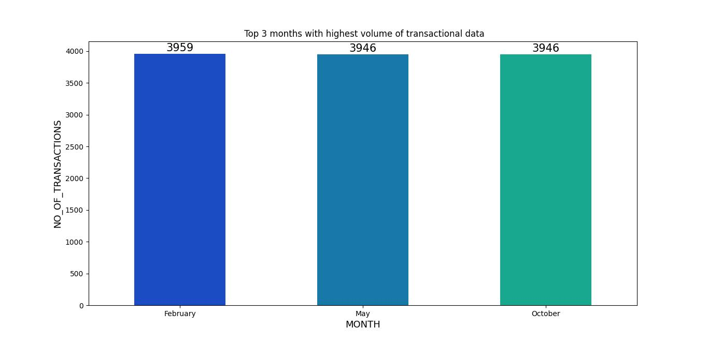

# Python_CLI
https://docs.google.com/document/d/1QxkEehdLovK2f8PfqzJtfRn83PwHyqAs0r-1rPwaXV8/edit

Data Engineering - Python CLI -Capstone Project 
In this project, I developed a Python Command Line Interface (CLI) application leveraging multiple technologies including Python, MySQL, pandas, matplotlib, seaborn, and PySpark. The project showcases my ability to design and implement data processing pipelines, perform ETL (Extract, Transform, Load) operations, and visualize data. Additionally, I utilized GitHub for version control and Jenkins for CI/CD (Continuous Integration/Continuous Deployment) pipelines, highlighting my skills in automating testing and deployment processes.

# Key Technologies and Tools
- Python: Used for scripting, data processing, and building the CLI application.
- MySQL: Utilized for storing and managing data.
- pandas: Employed for data manipulation and analysis.
- matplotlib & seaborn: Used for data visualization to create insightful charts and graphs.
- PySpark: Leveraged for distributed data processing and ETL operations.
- GitHub: Used for version control, ensuring collaborative development and code management.
- Jenkins: Implemented CI/CD pipelines to automate testing and deployment, enhancing reliability and efficiency.
- Install Libraries: Run the requirements.txt document in the terminal to install all required Python libraries:

<b>Workflow Diagram of the Requirements.</b>
The workflow diagram below will help you visualize the flow and scope of this capstone project at a high level.

### Credit Card Dataset Overview.
The Credit Card System database is an independent system developed for creating new user, viewing and managing existing customers, handling transactions made by the customers and approving or canceling requests, etc., using the architecture.
A credit card is issued to users to enact the payment system. It allows the cardholder to access financial services in exchange for the holder's promise to pay for them later. Below are three files that contain the customer’s transaction information and inventories in the credit card information.

- <b>CDW_SAPP_CUSTOMER.JSON:</b> This file has the existing customer details includes(SSN, FIRST_NAME, MIDDLE_NAME, LAST_NAME, CREDIT_CARD_NO, FULL_STREET_ADDRESS, CUST_CITY, CUST_STATE, CUST_COUNTRY, CUST_ZIP, CUST_PHONE, CUST_EMAIL, LAST_UPDATED).The combination of (CREDIT_CARD_NO + SSN) composite key is the Unique key for customer table. 

- <b>CDW_SAPP_CREDITCARD.JSON:</b> This file contains all credit card transaction information includes CREDIT_CARD_NO, TIMEID, CUST_SSN, BRANCH_CODE, TRANSACTION_TYPE, TRANSACTION_VALUE, TRANSACTION_ID. TRANSACTION_ID is the primary key and combination of (CREDIT_CARD_NO + SSN) composite key is the Unique key with respect to customer table.

- <b>CDW_SAPP_BRANCH.JSON:</b> Each branch’s information includes BRANCH_CODE, BRANCH_NAME, BRANCH_STREET, BRANCH_CITY, BRANCH_STATE, BRANCH_ZIP, BRANCH_PHONE, LAST_UPDATED and details are recorded in this file. BRANCH_CODE  

### Business Requirements - ETL

### 1. Functional Requirements - Load Credit Card Database (SQL)

### 1.1 Functional Requirement
For “Credit Card System,” created a Python and PySpark SQL function to read/extract the following JSON files according to the specifications found in the mapping document. https://docs.google.com/spreadsheets/d/1t8UxBrUV6dxx0pM1VIIGZpSf4IKbzjdJ/edit?gid=672931242#gid=672931242

### 1.2 Functional Requirement

Once PySpark reads data from JSON files, and then utilizes Python, PySpark, and Python modules to load data into RDBMS(SQL).
    
Created a creditcard_capstoned database in SQL(MySQL), and created a Python and Pyspark Program to write the “Credit Card System Data” into following tables in RDBMS:
-  CDW_SAPP_BRANCH
-  CDW_SAPP_CREDIT_CARD
-  CDW_SAPP_CUSTOMER       

### 2. Functional Requirements - Application Front-End
### 2.1 Transaction Details Module

Created a user defined function that accomplishes the following tasks:

    2.1.1 - Prompt the user for a zip code, provide contextual cues for valid input, and verify it is in the correct format.
    2.1.2 - Ask for a month and year,  and provide contextual cues for valid input and verify it is in the correct format.
    2.1.3 - Use the provided inputs to query the database and retrieve a list of transactions made by customers in the specified zip code for the given month and year.
    2.1.4 - Sort the transactions by day in descending order.

### 2.2 Customer Details Module

Created user defined function that accomplishes the following tasks:

    2.2.1 - to check the existing account details of a customer.
    2.2.2 - Used to modify the existing account details of a customer.
    2.2.3 - Used to generate a monthly bill for a credit card number for a given month and year.
    2.2.4 - Used to display the transactions made by a customer between two dates. Order by year, month, and day in descending order.

### 3. Functional Requirements - Data Analysis and Visualization
    Data Analysis and visualization are done using the Matlpoltlib & Seaborn python libraries. 

### 3.1 Calculate and plot which transaction type has the highest transaction count.

### 3.2 Calculate and plot top 10 states with the highest number of customers.

### 3.3 Calculate the total transaction sum for each customer based on their individual transactions. Identify the top 10 customers with the highest transaction amounts (in dollar value). Create a plot to showcase these top customers and their transaction sums.

### 4. Functional Requirements - LOAN Application Dataset

### Overview of LOAN Application Data API

Banks offer home loans across urban, semi-urban, and rural areas. Customers apply for a home loan, and the bank validates their eligibility. To automate this process in real time banks uses customer details such as Application_ID, Gender, Married, Dependents, Education, Self_Employed, Credit_History, Property_Area, Income, Application_Status from the online application form. They aim to identify eligible customer segments for targeted marketing, using a provided partial dataset. The dataset used for the LOAN Application is in the below API Endpoint

<b>API Endpoint:</b> https://raw.githubusercontent.com/platformps/LoanDataset/main/loan_data.json

### 4.1 Created a Python program to GET (consume) data from the above API endpoint for the loan application dataset.
Used API request.get() method to get response from API endpoint URL.

### 4.2 Calculate the status code of the above API endpoint. Hint: status code could be 200, 400, 404, 401.
Response is successful with the status code 200 and verified using response.statuscode.

### 4.3 Once Python reads data from the API, utilize PySpark to load data into RDBMS (SQL). The table name should be CDW-SAPP_loan_application in the database. Note: Use the “creditcard_capstone” database.
Used spark.read.JSON() to read the API data from endpoit URL , ulilized PySpark write method to load the API data into creditcard_capstone Database.

### 5. Functional Requirements - Data Analysis and Visualization for LOAN Application

### Create an appropriate visualization to perform the following task 

### 5.1 - Calculate and plot the percentage of applications approved for self-employed applicants. 

### 5.2 - Calculate the percentage of rejection for married male applicants. Use the ideal chart or graph to represent this data.

### 5.3 - Calculate and plot the top three months with the largest volume of transaction data. (hint: use `CDW_SAPP_CREDIT_CARD` table)

### 5.4 - Calculate and plot which branch processed the highest total dollar value of healthcare transactions. Use the ideal chart or graph to represent this data. (hint: use `CDW_SAPP_CREDIT_CARD` table)

# Project Details
# Data Processing and ETL Functionalities
<h6>Data Ingestion:</h6> The application ingests data from various sources and stores it in MySQL.
Data Transformation: Utilized pandas and PySpark to clean and transform the ingested data, preparing it for analysis.
Data Loading: Loaded the transformed data back into MySQL for further use and analysis.

# Command Line Interface (CLI)
User-Friendly Interface: Designed a CLI to interact with the application, allowing users to perform data processing tasks easily.
Functionalities: The CLI supports various commands for data ingestion, transformation, loading, and visualization.

# Data Visualization
Charts and Graphs: Created insightful visualizations using matplotlib and seaborn, enabling users to gain valuable insights from the data.
Reporting: Generated reports based on visualizations to assist in data-driven decision-making.

# Version Control and CI/CD
GitHub: Managed the project code using GitHub, ensuring version control and facilitating collaborative development.
CI/CD with Jenkins: Set up Jenkins pipelines to automate the testing and deployment processes. This ensured that the application is reliably built, tested, and deployed, reducing the chances of errors and improving development efficiency.

# Project Impact
Streamlined Data Processing: The project demonstrates my capability to design and implement efficient data processing pipelines.
Automation and Reliability: The use of CI/CD pipelines highlights my ability to automate processes, ensuring reliable application development and deployment.
Data-Driven Insights: The visualizations and reports generated by the application help users make informed decisions based on data.

# Conclusion
This project showcases my skills in data engineering, data analysis, and software development. By integrating various technologies and tools, I have developed a comprehensive application that not only processes and analyzes data but also provides valuable insights through visualizations. My experience with version control and CI/CD further underscores my ability to manage and automate complex projects efficiently.

